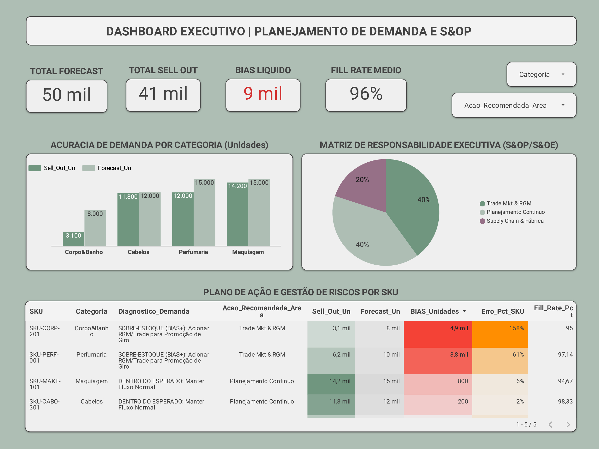

# 📊 Inteligência em Planejamento de Demanda & S&OP | End-to-End Analytics


## 📌 Visão Geral do Projeto

Este projeto consiste em uma solução **End-to-End de Engenharia e Análise de Dados** desenvolvida para resolver desafios reais de **Planejamento de Demanda, S&OP (Sales and Operations Planning) e Gestão de Estoques** na indústria de bens de consumo (FMCG).

A partir do processamento distribuído com **PySpark**, a solução limpa, consolida e calcula indicadores críticos de acurácia de demanda, mapeando vieses sistemáticos (BIAS) e direcionando **ações prescritivas** automatizadas para as áreas de **Trade Marketing/RGM**, **Supply Chain/Fábrica** e **Planejamento**. O ciclo encerra com a publicação de um **Dashboard Executivo e Tático no Looker Studio**.

---

## 🎯 Problema de Negócio & Objetivos

Modelos de previsão de demanda frequentemente sofrem com distorções de vendas (*Sell-out*) vs. entregas fabris (*Sell-in*). Previsões desalinhadas geram dois grandes riscos financeiros:

1. **Overforecasting (BIAS +):** Acúmulo de estoque, capital de giro imobilizado e riscos de obsolescência/vencimento.
2. **Underforecasting (BIAS -):** Ruptura nas prateleiras, perda de receita direta e insatisfação da rede de franqueados/clientes.

### **Objetivos da Solução:**
* Automatizar a ingestão e tratamento de volumetria de vendas e planejamento via **PySpark**.
* Monitorar a taxa de atendimento da fábrica (**Fill Rate**) e a dispersão dos erros de previsão (**MAPE / BIAS / Erro Absoluto**).
* Implementar um **motor de recomendação prescritivo** para direcionamento automático de gargalos aos times responsáveis.
* Fornecer visualização em tempo real para tomada de decisão no **Looker Studio**.

---

## 🛠️ Arquitetura da Solução & Tech Stack

[Dados Brutos (CSV/ERP)]
│
▼
[Pipeline PySpark (Google Colab / Environment)]
├── Tratamento e Sanitização de Tipos
├── Agregações e Engenharia de Métricas (BIAS, Fill Rate, % Erro)
└── Lógica Prescritiva Condicional (Matriz S&OP)
│
▼
[Data Export (CSV Tratado / Parquet)]
│
▼
[Looker Studio - Dashboard Executivo & Tático]


* **Linguagem & Engine:** Python 3.x, Apache Spark / PySpark.
* **Ambiente de Desenvolvimento:** Google Colab.
* **Data Viz / BI:** Google Looker Studio.
* **Métricas Principais:** `BIAS (Unidades)`, `MAPE / Erro % SKU`, `Fill Rate %`, `Forecast Un`, `Sell-Out Un`.

---

## 📊 Principais Indicadores Calculados (KPIs)

| Métrica | Conceito de Negócio | Impacto Estratégico |
| :--- | :--- | :--- |
| **BIAS (Unidades)** | Medida de viés direcional ($\text{Forecast} - \text{Sell Out}$). | Identifica a sobra ou a falta absoluta de produto na ponta. |
| **Erro % SKU** | Percentual de desvio absoluto em relação à venda real. | Avalia o nível de precisão do algoritmo de demanda por item. |
| **Fill Rate (%)** | Percentual de atendimento do pedido da fábrica ($\frac{\text{Atendido}}{\text{Sell In}}$). | Mede o nível de serviço e a eficiência logística fabril. |
| **Ação Prescritiva** | Classificação automática baseada na variação do BIAS. | Direciona o responsável direto (Trade Mkt, Supply Chain ou Planejamento). |

---

## 📈 Resultados & Painel Executivo no Looker Studio

O Dashboard Executivo foi estruturado com foco em **usabilidade, hierarquia visual e tomada de decisão ágil**:

1. **Camada de Indicadores de Topo (Scorecards):**
   * Consolidação de **Total Forecast** ($50.000$ un), **Total Sell-Out** ($41.100$ un), **BIAS Líquido** ($+9.000$ un) e **Fill Rate Médio** ($96,36\%$).
2. **Matriz de Responsabilidade Executiva (Gráfico de Pizza):**
   * **40% Trade Mkt & RGM:** Foco em ações promocionais para queima de sobre-estoque em categorias críticas.
   * **20% Supply Chain:** Urgência para reabastecimento de SKUs subestimados com risco de ruptura.
   * **40% Planejamento Contínuo:** Produtos operando dentro da margem tolerável de acurácia.
3. **Detalhamento Tático por SKU (Tabela Dinâmica):**
   * Ordenação estratégica por impacto de **BIAS**, permitindo a navegação rápida para mitigação de riscos de capital de giro.



---

## ⚙️ Como Executar o Código

1. Clone este repositório:
   ```bash
   git clone [https://github.com/julimarpoliveira2902/Intelig-ncia-em-Planejamento-de-Demanda-S-OP-End-to-End-Analytics.git](https://github.com/julimarpoliveira2902/Intelig-ncia-em-Planejamento-de-Demanda-S-OP-End-to-End-Analytics.git)
Abra o arquivo do notebook no Google Colab ou Jupyter Notebook:

Bash
jupyter notebook pipeline_sop_demand.ipynb
Garanta que a biblioteca PySpark esteja instalada:

Python
!pip install pyspark
Execute as células do pipeline para gerar a base tratada e sumarizada.

👤 Autor
Julimar Pedro de Oliveira

LinkedIn: [https://www.linkedin.com/in/julimar-oliveira-59984a1a4/]

